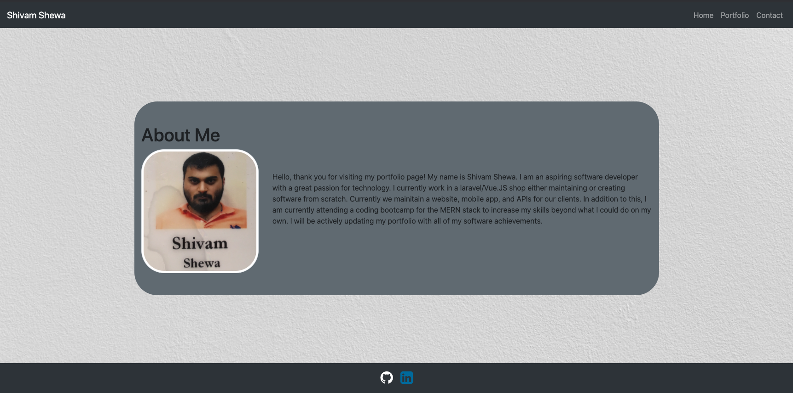
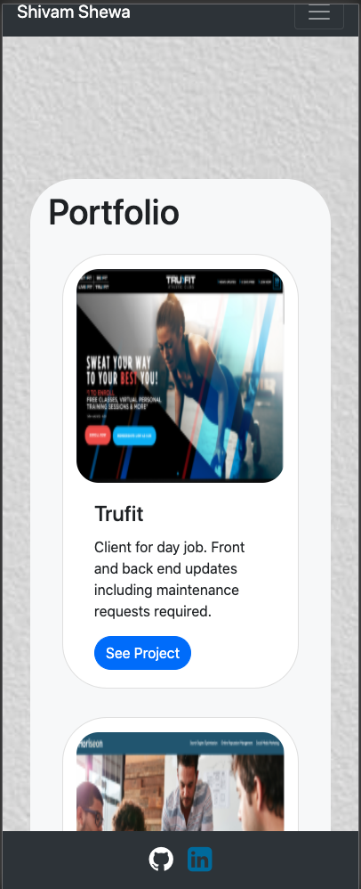

# Shivam Shewa Portfolio

## The Repository

This repository ("`02-css-bootstrap`") is where my portfolio resides [Shivam's Portfolio](https://shiv-ms.github.io/02-css-bootstrap/)  Periodic updates will be completed as I improve my software development and more projects are added.

### The Website maintains high code standards by:
* Using semantic HTML elements
* All image elements contain alt attributes
* A title has been provided
* Mobile-first design

## Shivam Shewa's Portfolio

#### Desktop Image of Homepage

  

#### Mobile Image of responsive Portfolio page

  

